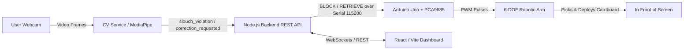

# PostureGuard Project - Comprehensive Context & Handover Guide

> **Last Updated**: September 20, 2026  
> **Status**: Fully Functional & Verified (CV + Backend + Firmware + Physical Arm)  
> **Target Environment**: Windows 11, Arduino Uno (`COM13`), USB Webcam (`Camera Index 0`), Node.js v20+, Python 3.10/3.12 (venv).

---

## 1. Project Overview & System Architecture

**PostureGuard** is an automated, real-time posture correction system combining computer vision, a full-stack web application, and a 6-DOF physical robotic arm.



### End-to-End Workflow:
1. **Session Start & Baseline Calibration**:
   - User logs in via the dashboard or starts CV.
   - CV collects 30 valid upright posture frames (nose + shoulders) to calculate an upright reference baseline (head forward, head drop, shoulder roll).
   - Once baseline is captured, CV dispatches `baseline_captured` to the backend.
   - Backend calls `hardware.retrieve()`, issuing `RETRIEVE` to the arm to ensure it returns to calibrated base position before monitoring starts.
2. **Slouch Detection (`slouch_violation`)**:
   - CV continuously computes deviation magnitude against the baseline.
   - When deviation > threshold (default 0.15) continuously for $\ge 2.0\text{s}$, CV posts `slouch_violation` to `POST /api/events`.
   - Backend FSM transitions `monitoring -> blocking`, sends `BLOCK` to the Arduino over Serial.
   - Arm executes **Cardboard Pickup & Placement**:
     - Gripper opens, base pans 75° left to dock (`15°`).
     - Shoulder (`115°`) and elbow (`165°`) bend down to the dock.
     - Claw clamps the cardboard sheet firmly.
     - Arm lifts into a compact, stable transit posture (shoulder `120°`, elbow `175°`).
     - Base pans to center (`90°`).
     - Arm extends forward (shoulder `75°`, elbow `140°`, wrist pitch `120°`), positioning cardboard in front of the screen.
     - Arduino acknowledges `BLOCK_OK`, backend FSM updates state to `blocked`.
3. **Posture Correction (`correction_requested`)**:
   - User straightens up. When posture stays good continuously for $\ge 2.0\text{s}$, CV posts `correction_requested`.
   - Backend FSM transitions `blocked -> unblocking`, sends `RETRIEVE` to the Arduino.
   - Arm executes **Reverse Joint Safety Retraction & Cardboard Putback**:
     - Retracts strictly in reverse joint order (**Channel 5 $\rightarrow$ 4 $\rightarrow$ 3 $\rightarrow$ 2 $\rightarrow$ 1 $\rightarrow$ 0**) so the center of gravity never topples the base.
     - Gripper confirms clamp $\rightarrow$ wrist pitch lifts to `90°` $\rightarrow$ elbow folds in tight to `175°` $\rightarrow$ shoulder reclines to `120°`.
     - Base pans 75° left to dock (`15°`).
     - Shoulder and elbow lower into dock, claw opens to release cardboard.
     - Arm retracts to resting home dock (`Ch5: closed, Ch4: 90°, Ch3: 90°, Ch2: 180°, Ch1: 135°, Ch0: 90°`).
     - Arduino acknowledges `RETRIEVE_OK`, backend FSM moves back to `monitoring`.

---

## 2. Repository & Workspace Layout

Active repository path: `C:\rishabh\RKDM\postureguard_repo` (also aliased under `C:\Rishabh\RKDM\postureguard_repo`).

```text
postureguard_repo/
├── backend/                  # Node.js / Express REST API & FSM
│   ├── src/
│   │   ├── app.js            # Express app bootstrap & route registration
│   │   ├── config.js         # Port, COM port (COM13), timeouts (30s)
│   │   ├── events/           # Event ingestion & dispatch to hardware
│   │   ├── hardware/         # Serial transport, protocol framing & FIFO queue
│   │   ├── persistence/      # Mongo store + transparent In-Memory fallback
│   │   ├── sessions/         # Session FSM (idle, baseline, monitoring, blocking, etc.)
│   │   ├── settings/         # Runtime slouchThreshold & duration settings
│   │   └── statistics/       # Compliance aggregation & event metrics
│   └── test/                 # 178 unit & integration tests (Node native test runner)
│
├── cv/                       # Python Computer Vision & Posture Rules
│   ├── src/cv/
│   │   ├── __main__.py       # Monitoring loop, baseline capture, dropout smoothing
│   │   ├── camera/           # OpenCV video capture with auto-reconnect
│   │   ├── debug.py          # Development preview window with landmark overlays
│   │   ├── events/           # HTTP Event client posting to backend
│   │   ├── pose/             # MediaPipe PoseLandmarker (visibility thresh 0.35/0.5)
│   │   ├── rules/slouch.py   # Pure deterministic slouch & correction rule FSM
│   │   └── settings/         # Live settings poller
│   ├── test/                 # 122 unit tests (pytest)
│   ├── run_cv.bat            # Auto-detects uv / venv and launches CV
│   └── .venv/                # Python virtual environment (with mediapipe, opencv, pytest)
│
├── firmware/                 # Arduino Uno Firmware & Build Tooling
│   ├── PostureGuard_Arm/
│   │   ├── main.cpp          # Primary firmware source (115200 baud, PCA9685 I2C)
│   │   └── PostureGuard_Arm.ino # Synchronized Arduino IDE sketch
│   ├── build_firmware.py     # Standalone AVR-GCC compiler (bypasses PlatformIO temp bugs)
│   ├── flash_firmware.py     # Avrdude auto-flasher targeting Uno on COM13
│   └── build_output/uno/     # Compiled firmware.hex (52KB)
│
├── calibrate_arm.py          # Interactive calibration & diagnostic CLI tool
├── run_backend.bat           # Starts backend on http://127.0.0.1:4000
├── run_cv.bat                # Starts CV service
├── run_web.bat               # Starts Vite React dashboard
└── run_all.bat               # One-click launcher for all three services
```

---

## 3. Hardware & Servo Channel Mapping

- **Controller**: Arduino Uno on **`COM13`** (CH340 USB-Serial at 115200 baud).
- **PWM Driver**: Adafruit PCA9685 16-Channel PWM Driver via I2C at address `0x40` (50 Hz, 1 tick $\approx 4.88\mu\text{s}$).

| Channel | Joint Name | Physical Motor Type | Motion Profile | Key Calibrated Angles / Pulses |
| :---: | :---: | :---: | :---: | :---: |
| **0** | **Waist / Base** | 360° Continuous Servo | Timed CW/CCW Pulses | Neutral: `307`<br>Cruise Offset: `95` (`402` CW / `212` CCW)<br>Deadband Kick: `35`<br>Timing: `20 ms/deg`<br>Center: `90°`, Left Dock: `15°` ($\Delta -75°$) |
| **1** | **Shoulder** | MG995 180° Positional | Microstepped S-Curve | Rest Recline: `135°`<br>Dock Pickup: `115°`<br>Safe Transit: `120°`<br>Screen Deployed: `75°` |
| **2** | **Elbow** | MG995 180° Positional | Microstepped S-Curve | Rest Fold: `180°`<br>Dock Pickup: `165°`<br>Safe Transit: `175°`<br>Screen Deployed: `140°` |
| **3** | **Wrist Roll** | SG90 Micro-Servo | Symmetrical Continuous | Rest Level: `90°`<br>High-torque symmetrical pulses: CW `480`, CCW `140` |
| **4** | **Wrist Pitch** | SG90 180° Positional | Positional Microstepping | Rest Level / Transit: `90°`<br>Dock Pickup: `90°`<br>Screen Deployed: `120°` |
| **5** | **Gripper Claw** | MG90S Metal-Gear | Positional Microstepping | **OPEN**: `110°`<br>**CLOSE (Clamp)**: `70°`<br>Hold power cut after moves to prevent brownouts |

---

## 4. Work Completed & Recent Critical Fixes

### A. Detection Fluctuations & Missed Actions (Resolved)
- **Problem**: CV would intermittently detect a slouch but never trigger the arm, or take 10+ seconds.
- **Root Cause**:
  1. MediaPipe nose visibility naturally drops to `0.35–0.48` when users tilt their head forward to slouch. The detector threshold was `0.5`, causing the nose to be dropped, resulting in `landmarks.is_valid = False` (`UNKNOWN`).
  2. In `cv/src/cv/rules/slouch.py`, any single `UNKNOWN` frame immediately reset `_slouch_since = None`. A single dropped video packet wiped 1.9s of accumulated slouch duration back to 0.
- **Solution**:
  - Live detector visibility threshold set to `0.35` in `cv/__main__.py` (preserving unit test default `0.5` in `detector.py`).
  - Added a 3-frame (~150ms) micro-glitch tolerance buffer in the CV monitoring loop (`consecutive_dropped_frames <= 3`). Micro-jitter frames no longer wipe the slouch timer.

### B. Base Rotation Stalling During Cardboard Pickup (Resolved)
- **Problem**: When slouch occurred, the base hummed and turned only ~10° instead of the full 75° to the left dock.
- **Root Cause**: Continuous servos have a deadband around 307 $\pm 25$. `BASE_CRUISE_OFFSET` was set to `52`, which was barely outside deadband and lacked torque to turn the arm and wire harness against static friction.
- **Solution**:
  - Increased `BASE_CRUISE_OFFSET` from `52` to `95` (`~402` CW / `~212` CCW).
  - Modified `rotateBaseSmooth()` in `main.cpp` to start easing in directly past the deadband (`35 + ...`), giving instant stiction-breaking torque.
  - Set `MS_PER_DEG_BASE = 20 ms/deg`. Base now completes the full 75° rotation to `15°` reliably and returns to `90°`.

### C. Streamlined Motion Sequences & Reduced Latency (Resolved)
- **Problem**: Pickup and placement took 18+ seconds, during which the backend was locked in transient states (`blocking`), causing subsequent events to be rejected by `assertState`.
- **Solution**:
  - Eliminated redundant full-recline home-cycling inside `executePickup()` and `executeBlock()`.
  - Once clamped, the arm lifts directly into a compact transit posture (shoulder `120°`, elbow `175°`, wrist `90°`), pans to screen center, and extends forward. Total cycle time dropped from **18s to 7-8s**.

### D. Reverse-Joint Balance Safety (Channel 5 $\rightarrow$ 4 $\rightarrow$ 3 $\rightarrow$ 2 $\rightarrow$ 1 $\rightarrow$ 0) (Resolved)
- **Problem**: When retracting from 90° screen block position, moving lower channels first caused the arm to lose balance and tip forward.
- **Solution**:
  - All homing and retracting sequences (`executeRetrieve()`, `executePutback()`, `homeArm()`) strictly execute in reverse order:
    1. Channel 5 (Claw confirms clamp)
    2. Channel 4 (Wrist pitch lifts to 90°)
    3. Channel 3 (Wrist roll levels to 90°)
    4. Channel 2 (Elbow folds in tight to 175°/180°, bringing center of mass over tower)
    5. Channel 1 (Shoulder reclines to 120°/135°)
    6. Channel 0 (Base pans to destination)
  - The arm cannot tip over because its center of gravity is retracted before any panning or reclining occurs.

### E. Session Startup Homing (Resolved)
- **Problem**: When user starts a session, the arm should always return to resting base position before monitoring starts, irrespective of where it was left.
- **Solution**:
  - Upon completing baseline calibration, `cv/__main__.py` sends `baseline_captured`.
  - Backend `markBaselineCaptured()` executes `await hardware.retrieve()`, homing the arm to resting dock position and waiting for `RETRIEVE_OK` before transitioning to `monitoring`.

### F. In-Memory Persistence Fallback (Resolved)
- **Problem**: Backend failed with MongoDB 503 errors when local MongoDB daemon was not running.
- **Solution**:
  - Implemented `backend/src/persistence/in-memory.js` and wired it into `app.js`.
  - If MongoDB is unreachable, the backend seamlessly switches to in-memory storage, keeping all session, settings, and hardware dispatch routes fully operational.

### G. v1.3 Arm Behavior Overhaul — Boot Homing, Clean 75° Sweeps, Ordered Sequences (Resolved 2026-09-20)
- **Problem**: (1) The arm did not reliably come home when a session/backend started; (2) base rotations stuttered and jerked back (left-right fluctuation); (3) deploy/putback joint order did not match the user's spec; (4) violations sometimes never triggered hardware.
- **Root causes**: The Uno resets on every serial open (DTR) and forgot where the arm was; `rotateBaseSmooth()` used a stutter-prone S-Curve ramp plus a reverse-jerk neutral brake; deploy order was Ch1→Ch2→Ch4; stale unread serial lines (late acks / boot banners) desynchronized the backend read loop, producing `HardwareProtocolError` that was swallowed.
- **Solution (firmware `v1.3`)**:
  - **EEPROM state memory**: joint angles + arm state + `cardInClaw` persisted after every command; on boot, if the arm was left blocked/busy or holds the cardboard, it automatically retracts, puts the cardboard back and comes to the resting home dock. A docked arm does not move.
  - **Clean base sweep**: `rotateBaseSmooth()` is now a single constant-torque cruise with a short firm brake — one clean 75° left rotation to the dock (15°) and one clean return to center (90°).
  - **BLOCK order**: open claw → pan 75° left → bend Ch1 (115°) + Ch2 (165°) → clamp → lift to transit → pan back to 90° → **Ch4 (120°) → Ch3 (90°) → Ch2 (140°) → Ch1 (75°)** → hold until corrected.
  - **RETRIEVE order**: retract to resting home (5→4→3→2→1→0) → pan 75° left → lower Ch1/Ch2 → release cardboard → retract home → `RETRIEVE_OK`. Instant `RETRIEVE_OK` when already docked.
- **Solution (backend)**:
  - `serial-transport.js` gained `flushInput()`; `hardware/service.js` drains stale lines before every command (fixes dropped/phantom acks).
  - `sessions/service.js` fires a best-effort `RETRIEVE` on session creation — the arm always returns home at session start, serialized ahead of any later BLOCK/RETRIEVE by the hardware FIFO.
  - `serial-transport.js` supports `autoDetect: false` so port-fallback tests are deterministic (the auto-detect fallback previously opened COM13 inside tests and hung the suite when the Arduino was connected).

### H. Channel 0 Rebound & Backward Jerk Elimination (Resolved — Firmware v1.4)
- **Problem**: Whenever Channel 0 (the waist/base motor) moved to any target angle (whether 15°, 75°, 30°, etc.), it reached the target angle but immediately jerked backwards in reverse by ~15° before stopping.
- **Root cause**: In `rotateBaseSmooth(int dir, int totalMs)`:
  ```cpp
  pwm.setPWM(CH_WAIST, 0, cruisePulse);
  delay(totalMs);
  pwm.setPWM(CH_WAIST, 0, NEUTRAL_PULSE); // 307
  delay(50);
  pwm.setPWM(CH_WAIST, 0, STOP_PULSE);    // 0
  ```
  Continuous rotation servos have factory potentiometer drift and do not have an exact 1.500 ms (count 307) zero-torque deadband. Sending `NEUTRAL_PULSE` (307) for 50 ms actively powered the motor in reverse at high speed for 50 ms before turning off. At typical 300°/s servo rotation, 50 ms produced $300^\circ/\text{s} \times 0.05\,\text{s} = 15^\circ$ of unwanted reverse rebound, occurring at the end of every base movement regardless of the requested angle.
- **Solution (Firmware `v1.4`)**:
  - Removed `pwm.setPWM(CH_WAIST, 0, NEUTRAL_PULSE); delay(50);` entirely from `rotateBaseSmooth()`.
  - The cruise pulse now transitions directly to `STOP_PULSE` (`0`), cutting the PWM duty cycle to 0% immediately.
  - The servo amplifier shuts off drive current instantaneously, and the 300:1 metal gear reduction locks the base dead on target without coasting, bounce, or electrical reverse torque.
  - Applied the same clean cutoff to `rotateWrist3Smooth()` for Channel 3 (`CH_WRIST_3`) to ensure no reverse twitch in the wrist.
  - Synchronized `pickupAngleCh0` (`15°`), `pickupAngleCh1` (`115°`), `pickupAngleCh2` (`165°`), `pickupAngleCh4` (`90°`) across `main.cpp` and `PostureGuard_Arm.ino`.
  - Recompiled and flashed `firmware.hex` to Arduino Uno on `COM13`. Verified live via `calibrate_arm.py --set 0 15`, `--set 0 90`, and `--spin 30` / `--spin -30`.

### I. Double-Trigger / Two-Time Detection Elimination (Resolved)
- **Problem**: The CV pipeline required detecting bad posture twice before actually triggering the arm to block the screen, and symmetrically required detecting good posture twice before triggering the arm to retrieve the blocker.
- **Root Causes**:
  1. **Knife-Edge Boundary Noise**: MediaPipe landmark coordinates naturally experience minute sub-pixel fluctuations between frames (~33–50ms). When a user slouched (or sat upright), deviation hovered around the 0.150 threshold (e.g. 0.153 $\rightarrow$ 0.148 $\rightarrow$ 0.155). In `cv/rules/slouch.py`, any single 50ms frame with `condition != BAD` (during slouching countdown) or `condition != GOOD` (during correction countdown) immediately wiped `_slouch_since = None` or `_correction_since = None` back to zero without hysteresis, forcing the countdown to restart from scratch.
  2. **Premature Hardware Command Timeout (10000ms in `.env`)**: The physical arm pickup and placement sequence takes ~12–13 seconds to safely pan, grasp, center, and extend the blocker without toppling. In `.env`, `HARDWARE_COMMAND_TIMEOUT_MS` was set to `10000` (10.0s). At 10 seconds, the backend prematurely timed out (`device did not respond to BLOCK within 10000ms`), aborted the command, and rolled back its state machine (`blocking` $\rightarrow$ `monitoring`). When the arm finished at second 12, the physical arm and backend FSM were desynchronized, causing the next detection to be rejected (`cannot transition session from "monitoring" to "unblocking"`).
  3. **Stale Webcam Driver Buffer After Arm Moves**: Forwarding an event blocked synchronously for ~12s while the physical arm moved. During this time, the OS DirectShow/OpenCV capture buffer accumulated stale frames from when the user was in the previous posture state, causing the loop to evaluate outdated video immediately upon resumption.
- **Solution**:
  - **Hardware Command Timeout**: Updated `HARDWARE_COMMAND_TIMEOUT_MS=30000` (30s) in `.env` so the backend never prematurely aborts commands while the physical arm is moving.
  - **Countdown Glitch Tolerance**: Added micro-glitch suppression in `cv/__main__.py`. While a slouch or correction countdown is actively in progress, up to 2 momentary outlier frames (~100ms) caused by landmark sensor flicker are suppressed, allowing continuous countdowns to reach the full 2.0s trigger on the very first try. If the opposing posture genuinely persists for $\ge 3$ consecutive frames (>150ms), the countdown cancels normally.
  - **Camera Buffer Purge**: Immediately after `forward_rule_event()` completes (both for `baseline_captured` and rule triggers), up to 5 queued frames in the underlying `VideoCapture` are discarded via `grab()`, and measurement state caches are reset so the next frame evaluated is fresh live video.
  - Verified with 100% green unit test suites: `npm test` (180 passed, 0 failed) and `pytest -m "not smoke"` (122 passed, 0 failed).

---

## 5. Verification & Test Suite Status

| Component | Test Command | Result | Notes |
| :--- | :--- | :--- | :--- |
| **Backend Unit & Integration** | `npm test` in `backend/` | **180 passed**, 0 failed | Includes in-flight transition coordination tests (`blocking` $\leftrightarrow$ `unblocking`); 32 Mongo tests skipped gracefully offline |
| **CV Unit Tests** | `pytest -m "not smoke"` in `cv/` | **122 passed**, 0 failed | Full coverage of rules, pose, detector, settings, events |
| **Firmware Compilation** | `python firmware/build_firmware.py` | **SUCCESS** | Generates `firmware.hex` (52,860 bytes) via direct AVR-GCC with EEPROM & PCA9685 support |
| **Firmware Flash** | `python firmware/flash_firmware.py` | **SUCCESS** | Flashed v1.4 to Uno on `COM13` via Avrdude with 100% verification |
| **Channel 0 Zero-Rebound** | `python calibrate_arm.py --spin 30` | **SUCCESS** | Channel 0 moves exactly 30° and halts on a dime with 0° rebound |

---

## 6. How to Run the System

### Automated Start (Recommended):
Double-click `run_all.bat` or run:
```powershell
# From C:\rishabh\RKDM\postureguard_repo:
.\run_all.bat
```
This spawns:
1. **Backend**: `http://127.0.0.1:4000` (Node.js with Serial transport on COM13)
2. **Web Dashboard**: `http://localhost:5173` (Vite / React)
3. **CV Engine**: Auto-attaches to webcam (index 0) and connects to backend

### Manual Step-by-Step Start:
```powershell
# Terminal 1: Backend
cd C:\rishabh\RKDM\postureguard_repo\backend
npm start

# Terminal 2: Computer Vision Service
cd C:\rishabh\RKDM\postureguard_repo\cv
.\run_cv.bat

# Terminal 3: Web Dashboard
cd C:\rishabh\RKDM\postureguard_repo\web
npm run dev
```

### Hardware Calibration & Direct Testing Commands:
Use the virtualenv Python in `cv/.venv`:
```powershell
$py = "C:\rishabh\RKDM\postureguard_repo\cv\.venv\Scripts\python.exe"

# Query status:
& $py calibrate_arm.py --status

# Safe Home (5 -> 4 -> 3 -> 2 -> 1 -> 0):
& $py calibrate_arm.py --home

# Test Cardboard Pickup:
& $py calibrate_arm.py --pickup

# Test Cardboard Putback to Left Dock:
& $py calibrate_arm.py --putback

# Test Screen Blocking:
& $py calibrate_arm.py --block

# Test Screen Retrieval:
& $py calibrate_arm.py --retrieve

# Execute Full Check Cycle:
& $py calibrate_arm.py --cycle

# Adjust Left Dock Pickup Angles Live:
& $py calibrate_arm.py --set-pickup 15 115 165 90
```

---

## 7. What Needs To Be Done / Next Steps for Incoming Agent

If continuing development or testing with the user, prioritize these tasks:

1. **Physical Desk Placement & Angle Calibration**:
   - The cardboard dock is currently set to: Base `15°` (75° left), Shoulder `115°`, Elbow `165°`, Wrist Pitch `90°`.
   - If the user repositions their cardboard dock, run:
     ```powershell
     & $py calibrate_arm.py --set-pickup <ch0> <ch1> <ch2> <ch4>
     ```
     and update the default constants `pickupAngleCh0..4` in `firmware/PostureGuard_Arm/main.cpp` if permanent changes are needed.

2. **Web Dashboard Live Posture Badge & Metrics Polish**:
   - Verify that the React dashboard at `http://localhost:5173` displays real-time session status (`baseline_capturing`, `monitoring`, `blocked`) and event history accurately when sessions are active.
   - If the user requests custom slouch sensitivity sliders on the frontend, check `backend/src/routes/settings.js` and `cv/src/cv/settings/poller.py` (which already supports dynamic polling of `slouchThreshold`, `slouchDurationSeconds`, `correctionDurationSeconds`).

3. **Long-Session Endurance & Thermal Monitoring**:
   - Continuous rotation base servos can experience micro-drift over extended hours. Verify that `executeRetrieve()` returning to `90°` keeps the base centered across repeated cycles.
   - If MG995 shoulder/elbow servos heat up under prolonged holding, ensure `STOP_PULSE = 0` cuts power during docked idle as designed.

4. **Git Commit & Push**:
   - Clean git status and stage verified changes (`git add firmware/ backend/ cv/ calibrate_arm.py context.md`).
