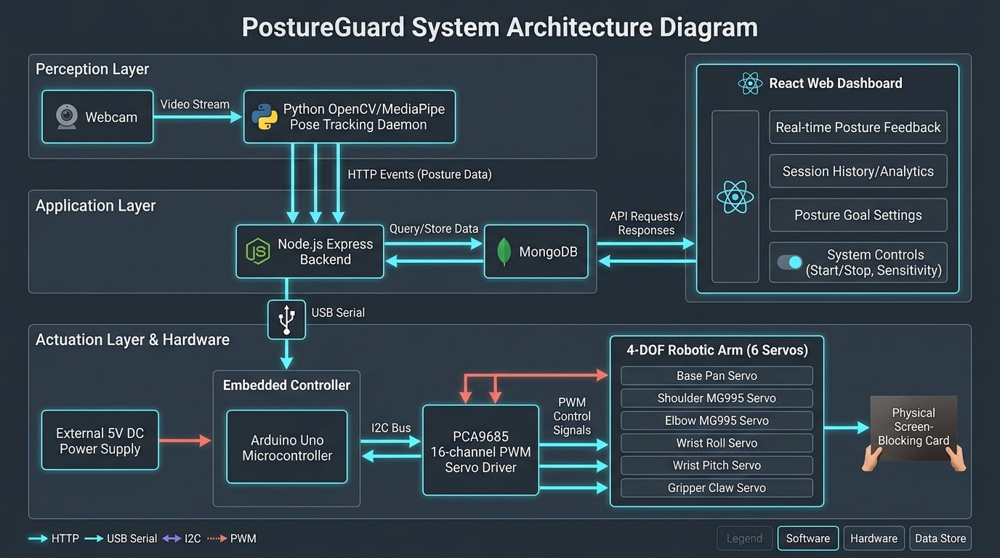
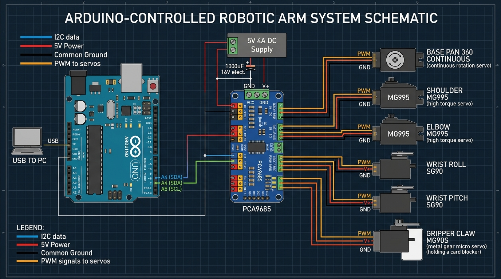
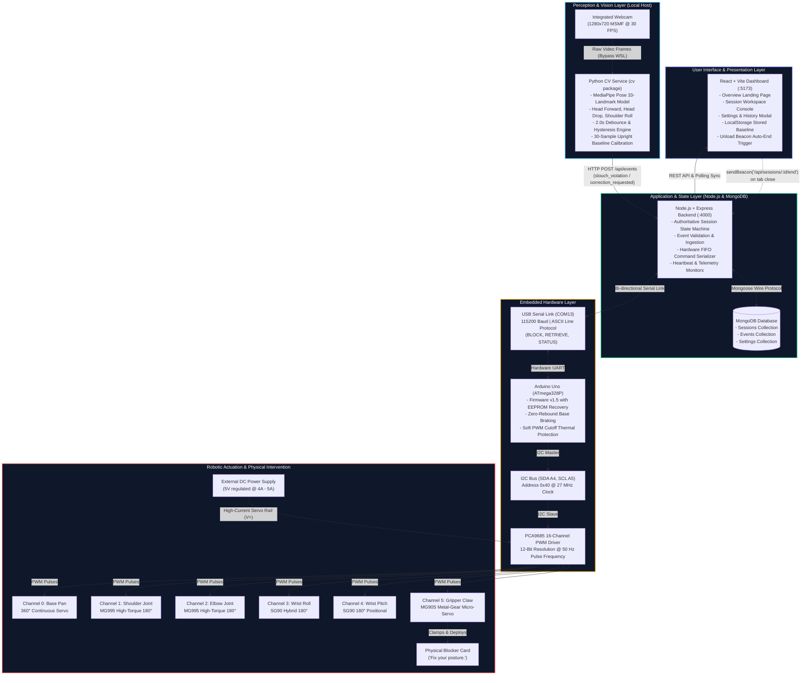

# PostureGuard — Block Diagram & Circuit Diagram

This document contains the complete **System Block Diagram**, **Circuit Schematic**, and **Wiring Specification** for the PostureGuard project.

---

## Visual Diagrams

### 1. System Architecture Block Diagram


### 2. Hardware Circuit Schematic & Wiring Diagram


---

## 1. System Block Diagram



---

## 2. Hardware Circuit Diagram

```
                 HOST PC (USB 3.0 / USB 2.0 PORT)
                    │                    │
          [USB 5V Power]          [USB Data +/-]
          (500mA logic)                  │
                    │                    ▼
                    │           ┌─────────────────┐
                    └──────────▶│   Arduino Uno   │
                                │   (ATmega328P)  │
                                └────────┬────────┘
                                         │
                 ┌───────────────────────┴───────────────────────┐
                 │                                               │
                 │ 5V Logic Power (Pin 5V)                       │
                 ├──────────────────────────────┐                │
                 │ Common Ground (Pin GND)      │                │
                 ├────────────────────┐         │                │
                 │ I2C SDA (Pin A4)   │         │                │
                 ├──────────┐         │         │                │
                 │ I2C SCL  │         │         │                │
                 │ (Pin A5) │         │         │                │
                 │          │         │         │                │
                 ▼          ▼         ▼         ▼                │
              ┌─────┐    ┌─────┐   ┌─────┐   ┌─────┐             │
              │ SCL │    │ SDA │   │ GND │   │ VCC │             │
              └─────┘    └─────┘   └─────┘   └─────┘             │
                 │          │         │         │                │
  ┌──────────────┴──────────┴─────────┴─────────┴─────────────┐  │
  │              PCA9685 16-Channel 12-bit PWM Driver         │  │
  │                     (I2C Address: 0x40)                   │  │
  │                                                           │  │
  │   [Power Screw Terminal]                                  │  │
  │      V+          GND                                      │  │
  └───▲───────▲───────▲───────▲───────▲───────▲───────▲───────┘  │
      │       │       │       │       │       │       │          │
      │       │       │       │       │       │       │          │
      │       │       └───────┼───────┼───────┼───────┼──────────┘
      │       │               │       │       │       │       (Common Ground)
      │       │               │       │       │       │
      │       │               │       │       │       │
      │  ┌────┴───────────────┴────┐  │       │       │
      │  │  1000 µF / 16V Decoupling│  │       │       │
      │  │   Electrolytic Capacitor│  │       │       │
      │  └────┬───────────────┬────┘  │       │       │
      │       │               │       │       │       │
      │       │               ▼       │       │       │
      │       │           ┌───────┐   │       │       │
      │       └───────────┤  GND  │   │       │       │
      │                   └───────┘   │       │       │
      │                   EXTERNAL    │       │       │
      │                 POWER SUPPLY  │       │       │
      │                   (5V / 4A)   │       │       │
      │                   ┌───────┐   │       │       │
      └───────────────────┤  +5V  │   │       │       │
                          └───────┘   │       │       │
                                      │       │       │
      ┌───────────────────────────────┴───────┴───────┴───────────────────────────────┐
      │                         PCA9685 SERVO OUTPUT CHANNELS                         │
      │  Each Channel: [PWM Signal (Yellow)] | [V+ 5V (Red)] | [GND (Brown/Black)]    │
      └───────┬──────────────┬──────────────┬──────────────┬──────────────┬───────────┘
              │              │              │              │              │
              │ Ch 0         │ Ch 1         │ Ch 2         │ Ch 3         │ Ch 4 & 5
              ▼              ▼              ▼              ▼              ▼
        ┌───────────┐  ┌───────────┐  ┌───────────┐  ┌───────────┐  ┌───────────┐
        │  Channel 0│  │  Channel 1│  │  Channel 2│  │  Channel 3│  │  Channel 4│
        │  Base Pan │  │  Shoulder │  │   Elbow   │  │ Wrist Roll│  │Wrist Pitch│
        │   360°    │  │   MG995   │  │   MG995   │  │   SG90    │  │   SG90    │
        │Continuous │  │180° Metal │  │180° Metal │  │180° Micro │  │180° Micro │
        └───────────┘  └───────────┘  └───────────┘  └───────────┘  └───────────┘
                                                                          │
                                                                          │ Ch 5
                                                                          ▼
                                                                    ┌───────────┐
                                                                    │  Channel 5│
                                                                    │Claw / Grip│
                                                                    │   MG90S   │
                                                                    │180° Metal │
                                                                    └─────┬─────┘
                                                                          │ (Clamps)
                                                                          ▼
                                                                    ┌───────────┐
                                                                    │  Blocker  │
                                                                    │   Card    │
                                                                    └───────────┘
```

---

## 3. Circuit Wiring & Pin Interconnection Table

| From Component | Pin / Terminal | To Component | Pin / Terminal | Wire Color | Purpose |
| :--- | :--- | :--- | :--- | :--- | :--- |
| **Arduino Uno** | 5V | **PCA9685** | VCC | Red | +5V Logic Power for PCA9685 chip |
| **Arduino Uno** | GND | **PCA9685** | GND | Black | Common Logic Ground |
| **Arduino Uno** | A4 (SDA) | **PCA9685** | SDA | Blue / Green | I2C Data Line (Bi-directional) |
| **Arduino Uno** | A5 (SCL) | **PCA9685** | SCL | Yellow | I2C Clock Line |
| **External PSU (5V/4A)** | +5V (VOUT) | **PCA9685** | V+ (Screw Block) | Thick Red | High-Current Servo Power Rail (5V) |
| **External PSU (5V/4A)** | GND (0V) | **PCA9685** | GND (Screw Block) | Thick Black | High-Current Servo Ground Return |
| **Arduino Uno** | GND | **External PSU** | GND | Black | **Essential Common Ground Tie** |
| **Capacitor (1000 µF)** | Anode (+) | **PCA9685** | V+ (Screw Block) | Direct | Filters inrush motor inductive spikes |
| **Capacitor (1000 µF)** | Cathode (-) | **PCA9685** | GND (Screw Block) | Direct | Decouples servo power rail |
| **PCA9685** | Channel 0 Header | **Base Servo (360°)** | 3-Pin Female Plug | Yellow/Red/Brown | Waist Pan Continuous Drive |
| **PCA9685** | Channel 1 Header | **Shoulder MG995** | 3-Pin Female Plug | Orange/Red/Brown | Shoulder Joint 180° Positional Drive |
| **PCA9685** | Channel 2 Header | **Elbow MG995** | 3-Pin Female Plug | Orange/Red/Brown | Forearm Joint 180° Positional Drive |
| **PCA9685** | Channel 3 Header | **Wrist Roll SG90**| 3-Pin Female Plug | Orange/Red/Brown | Wrist Roll Joint Drive |
| **PCA9685** | Channel 4 Header | **Wrist Pitch SG90**| 3-Pin Female Plug | Orange/Red/Brown | Cardboard Angle Pitch Drive |
| **PCA9685** | Channel 5 Header | **Gripper MG90S** | 3-Pin Female Plug | Orange/Red/Brown | Clamps & Holds Blocker Sheet |
| **Host PC USB** | USB Type-A | **Arduino Uno** | USB Type-B | Standard USB | 115200 Baud Serial Communication (COM13) |

---

## 4. Electrical Design & Power Budget

### 4.1 Power Separation & Isolation
- **Logic Rail (+5V from USB)**: Powers only the ATmega328P microcontroller and the logic processing core of the PCA9685 driver chip (~60 mA total draw).
- **Actuator Rail (+5V from External Power Supply)**: High-current rail dedicated strictly to the 6 servo motors. Servos must **never** be powered directly from the Arduino 5V pin, as motor inrush currents trigger ATmega328P brown-out resets.
- **Common Ground Requirement**: The Arduino `GND` pin and the External PSU `GND` are tied together directly at the PCA9685. Without this common reference, I2C logic voltage thresholds will float, causing erratic servo jitter.

### 4.2 Current Budget Breakdown

| Component | Model | Quantity | Idle Current | Peak / Stall Current |
| :--- | :--- | :--- | :--- | :--- |
| Arduino Uno | ATmega328P | 1 | 45 mA | 55 mA |
| PCA9685 Driver | NXP PCA9685 | 1 | 10 mA | 15 mA |
| Base Pan Servo | 360° Continuous | 1 | 15 mA | 550 mA |
| Shoulder Servo | MG995 Metal Gear | 1 | 20 mA | 1,200 mA |
| Elbow Servo | MG995 Metal Gear | 1 | 20 mA | 1,200 mA |
| Wrist Roll Servo | SG90 Micro | 1 | 10 mA | 350 mA |
| Wrist Pitch Servo | SG90 Micro | 1 | 10 mA | 350 mA |
| Gripper Servo | MG90S Metal Gear | 1 | 10 mA | 500 mA |
| **Total Worst-Case** | — | — | **~140 mA** | **~4,220 mA (4.22 A)** |

### 4.3 Firmware Thermal & Power Protections
1. **Kinematic Staging**: Joints never accelerate simultaneously from dead-stops. Motions are staged sequentially (Shoulder -> Elbow -> Wrist) to keep simultaneous peak draw below 2.2 Amperes.
2. **Zero Holding-Torque PWM Cutoff**: Once a servo reaches its target angle, `pwm.setPWM(ch, 0, STOP_PULSE)` cuts the PWM pulse stream. The mechanical reduction gearbox holds position, eliminating motor coil heating and standby power dissipation.
3. **Decoupling Capacitor**: A 1000 µF low-ESR electrolytic capacitor across the V+ rail absorbs inductive kickback when motors stop abruptly.
